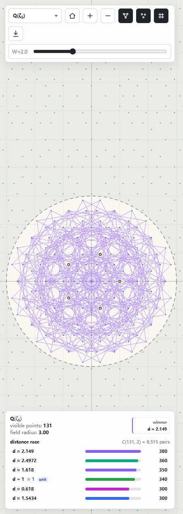

# Number-Field Point-Set Explorer

Interactive browser explorer for planar point sets obtained from rings and simple orders in selected number fields, with cut-and-project windows for higher-rank examples.

[Open the interactive explorer](https://liuyao12.github.io/Erdos-unit-distance/)

The page is entirely browser-side JavaScript. Viewing or using it does not require Python, a local server, or a build step.

## What It Draws

Choose a field from the inclusion poset in the left panel. The vertical placement is scaled by field degree, with higher-degree fields above lower-degree fields; the row labels and status box both show the degree.

- `Q(i)` and `Q(ζ_3)` draw the full planar lattices `Z[i]` and `Z[ζ_3]`.
- `Q(√-2)` draws the full planar lattice from `Z[√-2]`.
- `Q(ζ_m)` and `Q(√-2, √-3)` for higher-degree fields draw finite visible patches of cut-and-project point sets from their displayed integer order.

For a selected cyclotomic `m`, each element is represented in the power basis

$$
z=a_0+a_1\zeta_m+\cdots+a_{\varphi(m)-1}\zeta_m^{\varphi(m)-1}.
$$

For the square-root examples, the app uses the displayed basis, such as `1, α` for `α² = -2` and `1, α, β, αβ` for `α² = -2, β² = -3`. The canvas uses the first complex embedding as physical space. For fields with additional complex embeddings, the app keeps only points whose internal embeddings lie inside radius-`W` disks. This window makes the projected point set locally finite; projecting the whole higher-dimensional order without a window would be dense.

For cyclotomic fields, the rhomb overlay projects square faces spanned by root-of-unity directions. A square using directions `ζ^i` and `ζ^j` becomes a rhomb in the plane, with its shape determined by the cyclic separation `min(|i-j|, m-|i-j|)`. The same single `W` control selects the vertices used for both the point set and this square-face overlay.

The Moser ring `Z[ω_1,ω_3]`, with `ω_1=1+ζ_3` and `ω_3=(5+√-11)/6=(η+2)/3`, is contained in the localized integer ring `O_K[1/3]`. The Moser ring and `O_K[1/3]` views have a 3-adic denominator screen: their `D` slider keeps sampled points whose integral-basis coordinates have denominators dividing a power up to `3^D` (after cancellation), while the secondary `W₀` slider controls the Archimedean seed window used before applying the denominator layers.

## Distance Edges

The circular lens defines the finite point set currently being measured. Inside that lens, the app counts all pair distances, groups equal distances by the exact coefficient vector for

$$
\Delta z\,\overline{\Delta z},
$$

and shows a live distance race. Rows animate into their new order as pan and zoom change the lens. Labels show decimal distance, plus an exact `√k` label when `d²` is an integer.

The canvas draws edges for the current race leader, with color tied to the active distance. Clicking a race row pins that distance until the row is clicked again or another distance is selected. Unit distance appears in the race even when it is not the leader. Hovering a point shows its element in the selected ring and highlights the active distance edges incident to that point.

When the lens contains an `n` covered by the vendored lower-bound table, the status box shows a linked lower bound for `u(n)`, the maximum possible number of unit distances among `n` planar points. The snapshot comes from Kevin Moore's [Point sets with many unit distances](https://users.renyi.hu/~kjmoore/units.html) table. For missing `n`, the app fills gaps with elementary derived lower-bound rules, including the one-point extension `u(k + 1) >= u(k) + 2` and the gluing rule `u(a + b) >= u(a) + u(b) + 2`. These derived values are guaranteed constructions, not claims that the compact record search is complete for that `n`.

This is an illustration tool for selected number-field point sets. It is not trying to beat, compare with, or reproduce the Erdős square-lattice construction.

## Controls

- Home button: center the viewport back at the origin while preserving zoom.
- Drag to pan.
- Mouse wheel or trackpad scroll to zoom.
- Use the left poset to change fields; on mobile, open it from the fields button in the toolbar.
- Use the toolbar to toggle leader-distance edges, cyclotomic rhombs, points/grid, change the internal window radius, export a PNG, or export the current lens as SVG.
- In the Moser ring and `O_K[1/3]` views, use `D` as a 3-adic denominator cutoff and `W₀` as the seed cut-and-project radius.

## Files

- `index.html` - GitHub Pages entry point and UI styles.
- `app.js` - self-contained field reconstruction, drawing, interaction, exact distance grouping, and visible-edge counting.
- `unit_distance_bounds.js` - vendored lower-bound snapshot for the status box.
- `docs/screenshot.png` - README preview screenshot.

## Mathematical Context

The app is a visual sandbox for rings and orders such as `Z[i]`, `Z[ζ_3]`, `Z[ζ_5]`, `Z[√-2]`, and `Z[√-2, √-3]`, plus related cut-and-project model sets. It helps inspect repeated distances, local density, and the geometry of visible patches across different displayed fields. It should not be read as a proof experiment for the asymptotic Erdős unit-distance problem.
