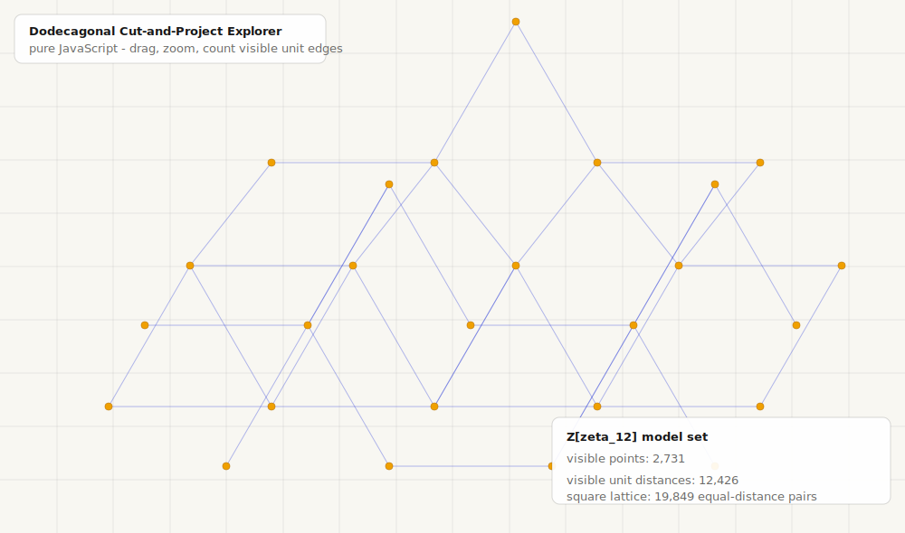

# Erdős Unit Distance: Dodecagonal Cut-and-Project Explorer

Interactive browser explorer for the 12-fold symmetric point set that came up while looking at a low-dimensional toy version of recent unit-distance constructions.

[Open the interactive explorer](https://liuyao12.github.io/Erdos-unit-distance/)

The interactive page is entirely browser-side JavaScript. Viewing or using it does not require Python, a local server, or a build step.

This project was created entirely by Codex with GPT-5.5 Pro.

## What It Draws

The hosted page is a static JavaScript app. It reconstructs the visible part of the infinite model set

$$
\Lambda_W=\{z\in\mathbb{Z}[\zeta_{12}]: |z^\star|\le W\}.
$$

Writing $\rho=\exp(2\pi i/3)$, a point is represented by four integers:

$$
z=a+bi+c\rho+di\rho,
\qquad
z^\star=a-bi+c\rho-di\rho .
$$

The canvas draws the physical coordinate $z$, while $z^\star$ is the internal-space coordinate used for the cut-and-project window. Keeping $|z^\star|\le W$ and projecting $z$ gives a locally finite dodecagonal model set. Projecting the whole 4D lattice without the window would be dense.

## Unit Edges

The blue segments are all visible pairs at physical distance $1$. In this $\mathbb{Z}[\zeta_{12}]$ case, the only coefficient differences with $|\Delta z|=1$ are the 12 root-of-unity directions, so the JavaScript checks those finite neighbor steps instead of doing an all-pairs search.

The optional Python scripts are probes used to verify and reproduce the same construction. They are not used by the GitHub Pages app; the interactive page itself only needs `index.html` and `app.js`.

## Controls

- Home button: center the viewport back at the origin while preserving zoom.
- Drag to pan.
- Mouse wheel or trackpad scroll to zoom.
- Use the toolbar to zoom, toggle unit edges/grid, change the internal window radius, or export a PNG.

## Metrics

The status panel reports only the current visible comparison:

- visible points `n`.
- visible unit distances `m`.
- the number of equal-distance pairs obtained by arranging the same `n` points in a square lattice and rescaling the most common lattice distance to length 1.

For a finite set $P\subset\mathbb R^2$, the relevant count is

$$
u(P)=\left|\{\{p,q\}\subset P: |p-q|=1\}\right|.
$$

The unit-distance problem asks how large

$$
U(n)=\max_{|P|=n} u(P)
$$

can be. The square-lattice count shown in the panel is a direct comparison with the classic Erdős grid construction at the same screen-visible $n$; it is a benchmark, not the unknown true optimum $U(n)$.

## Projection Knobs

For this particular reconstruction, the cyclotomic lattice and the two embeddings are fixed:

$$
\mathbb{Z}[\zeta_{12}]\longrightarrow \mathbb C_{\mathrm{phys}}\times \mathbb C_{\mathrm{int}},
\qquad
z\longmapsto (z,z^\star).
$$

So the 12-fold symmetry and the unit-neighbor directions are rigid. The app exposes one natural knob: the window radius $W$ in $|z^\star|\le W$. Increasing $W$ lets more lattice points through and makes the visible point set denser; decreasing $W$ makes a thinner, sparser patch. This changes the accepted slice of the lattice, not the projection direction.

Other legitimate variants would translate the internal window, change its shape, or replace the number field/embedding pair. Those are different model sets rather than merely a different view of this one.

## Files

- `index.html` - GitHub Pages entry point.
- `app.js` - self-contained JavaScript reconstruction, drawing, interaction, and visible-edge counting.
- `docs/screenshot.svg` - README preview generated from the same model-set formula.
- `dodecagonal_probe.py` - reconstructs the original radius-4 screenshot-style patch and writes an SVG.
- `reconstruct_12fold.py` - writes a clean static SVG reconstruction.
- `model_set_window_probe.py` - verifies the model-set interpretation and unit-difference classes.
- `growth_probe.py` - checks that fixed 4D/window growth has linear unit-edge density.

## Mathematical Context

This 4D example is a cut-and-project dodecagonal model set, closely related to standard 12-fold quasicrystal and square-triangle tiling constructions. It should not be confused with the full asymptotic unit-distance theorem, whose proof uses projected lattices from number fields of growing degree.
